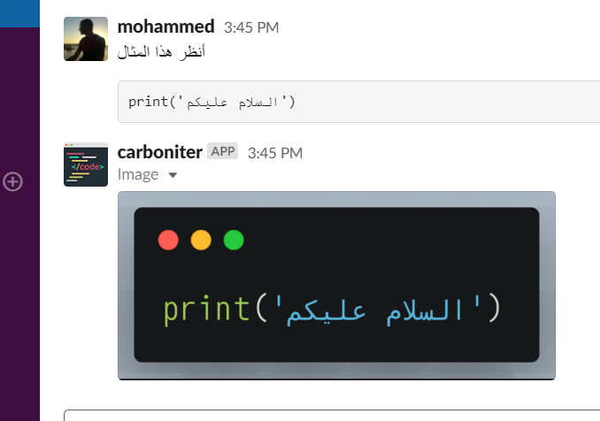

# Carboniter


[](https://github.com/feross/standard)

Carboniter is scraper tool for [carbon.now.sh](https://carbon.now.sh/) page, as a Slack bot.


### How it works

After adding carbonier bot in slack channel send `code block` carboniter will send code block to carbon website and screenshot styled code then send back to slack channel.



### For Developers 

### Clone source code

```shell
$ git clone https://github.com/mohamed-okasha/carboniter.git
$ cd carboniter
```
### Install

```shell
$ npm install
```

### Copy `.env-example` to `.env`

```shell
$ cp .env-example .env
```

### Configure
- create slack app
- add environment variables in `.env` from slack app `Basic Information` page
```shell
NODE_ENV=development
PORT=3000
SLACK_TOKEN= xoxb-.....-.....-.....
SLACK_SIGNING_SECRET= ..........
APP_VERIFICATION_TOKEN= ......
```
### Test Run

```shell
$ npm start

🚀 Carbointer LIVES on PORT 3000 🚀
```
### Deploy on heroku

```shell

$ heroku create {optional-app-name}

Creating app... done, stack is app-name
https://app-name.herokuapp.com/

$ git add . & git commit -m 'init version'
$ git remote add heroku https://git.heroku.com/heroku-app-git-repo-link.git
$ git push heroku master

...
remote: -----> Node.js app detected
...
remote:        https://app-name.herokuapp.com/ deployed to Heroku
...
To https://git.heroku.com/heroku-app-git-repo-link.git
 * [new branch]      master -> master

$ heroku open
```

### License

**[This project is licensed under the terms of the MIT license.](http://license-me.herokuapp.com)**
 -- [_Need your own? There's a button for that :wink:_](https://github.com/mattcreager/license)
